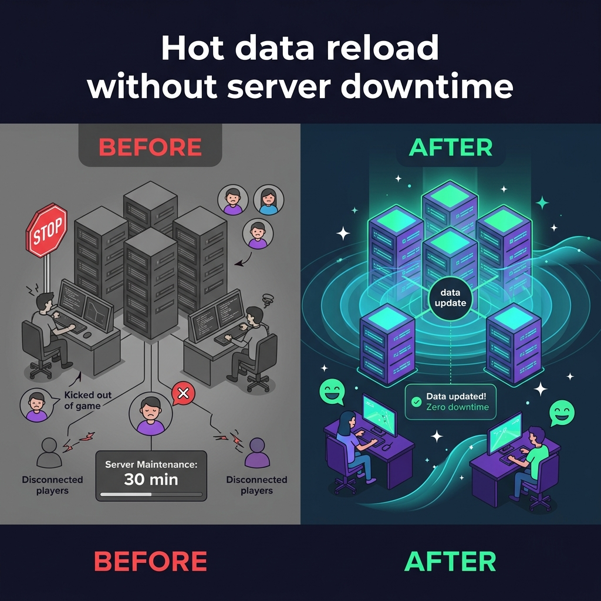
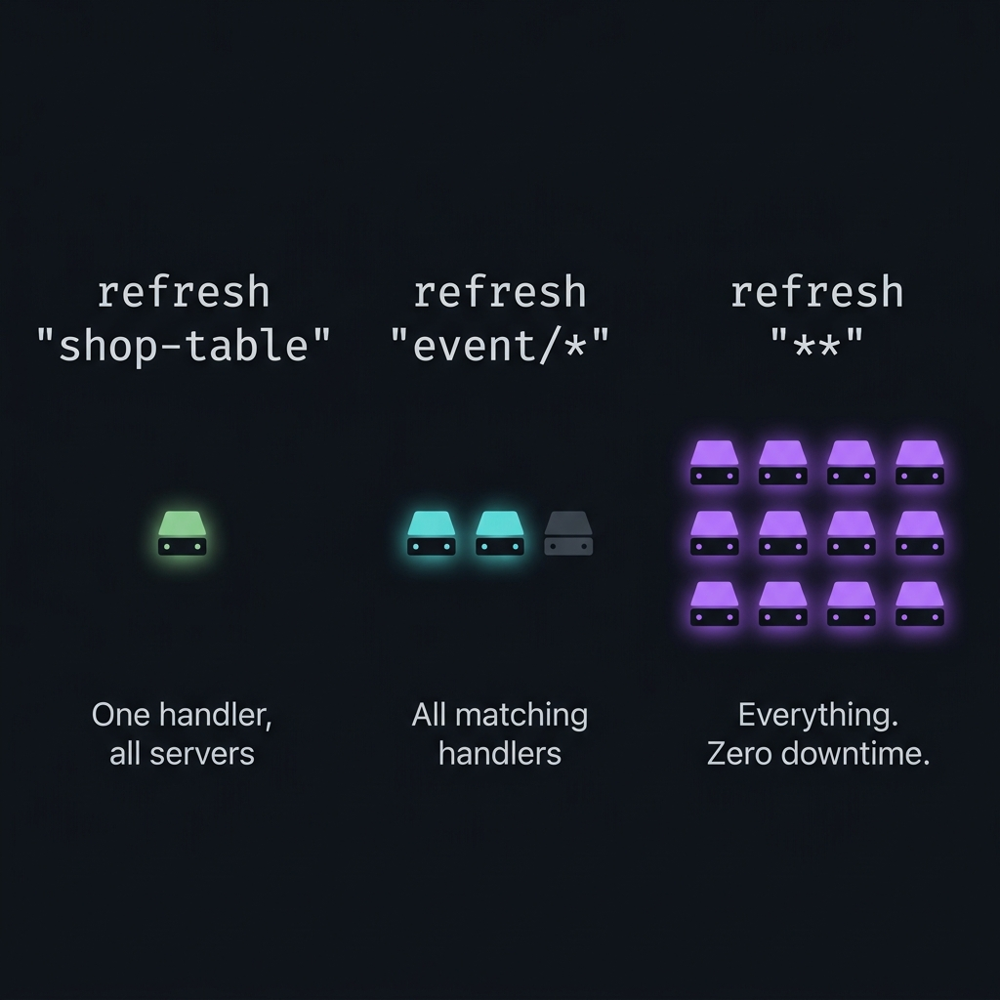
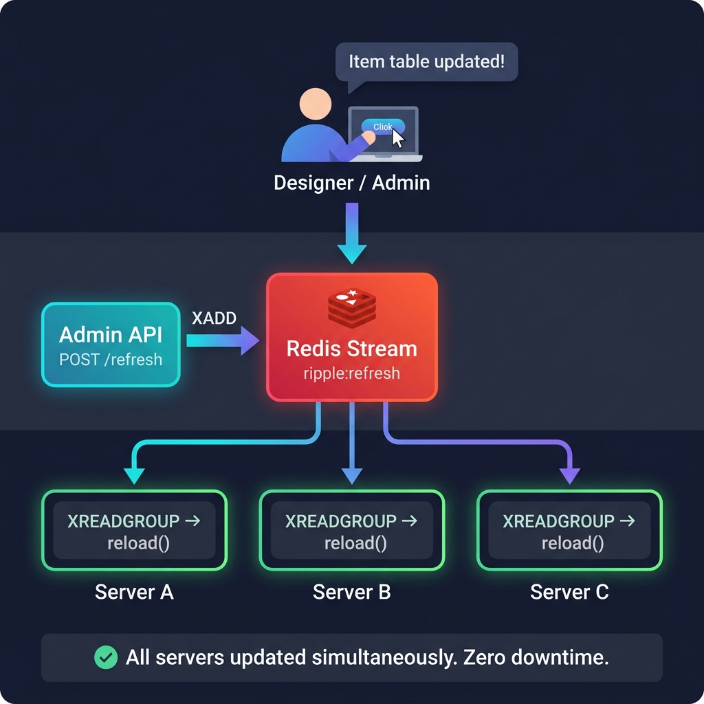

# @gatrix/ripple

**데이터 변경을 몇 시간이 아닌 몇 초 만에 라이브 서버에 반영하세요.**

**Ripple**이라는 이름은 수면에 돌 하나를 떨어뜨리면 파문이 사방으로 퍼져나가는 모습에서 왔습니다. 데이터 변경 한 번이면, 모든 서버 인스턴스에 즉시 그리고 안정적으로 전파됩니다.





---

## 왜 Ripple인가?

### 이미 겪고 있는 문제

모든 라이브 게임 서비스는 결국 이 벽에 부딪힙니다:

🔴 **"기획팀이 아이템 밸런스 테이블을 수정했습니다. 서버 점검이 필요합니다."**

설정 하나 바꾸는 데 30분 점검. 플레이어는 강제 퇴장. 매출은 떨어지고. 디스코드는 불만으로 가득 차고. 운영팀은 또 야근합니다.

밸런스 테이블만이 아닙니다:

| 상황 | Ripple 없이 | Ripple 사용 시 |
|------|-----------|--------------|
| 아이템/상점 설정 업데이트 | 🔴 서버 재시작 필요 | 🟢 1초 이내 핫 리로드 |
| 깨진 이벤트 긴급 핫픽스 | 🔴 점검 예약, 플레이어 공지 | 🟢 `event/*` 발행 — 즉시 수정 |
| 로컬라이제이션 오타 수정 | 🔴 전체 배포 파이프라인 | 🟢 `curl -X POST /ripple/refresh -d '{"pattern":"localization/*"}'` |
| A/B 테스트 설정 토글 | 🔴 모든 서버 재배포 | 🟢 API 한 번, 전 서버 동시 업데이트 |
| DB 마이그레이션 후 멀티 서버 정합성 | 🔴 다운타임 위험 있는 롤링 재시작 | 🟢 `**` 브로드캐스트 — 전 서버 전 핸들러 리로드 |

### 동작 원리 (30초 버전)



### Redis Pub/Sub를 쓰면 안 되나?

*"Pub/Sub로도 할 수 있는 거 아닌가?"* 라고 생각할 수 있습니다.

할 수는 있습니다 — 처음 장애가 발생하기 전까지는:

| 우려 사항 | Redis Pub/Sub | Ripple (Redis Streams) |
|----------|---------------|----------------------|
| 리프레시 도중 서버 크래시 | ❌ 메시지 영구 소실 | ✅ XPENDING + XCLAIM 자동 복구 |
| 네트워크 순단으로 서버 연결 끊김 | ❌ 장애 중 모든 메시지 소실 | ✅ 마지막 ACK 위치부터 재개 |
| 같은 이벤트 중복 처리 | ❌ 보호 장치 없음 | ✅ SET NX EX를 통한 중복 제거 |
| 두 서버가 같은 핸들러에 경합 | ❌ 동시 실행 | ✅ 분산 잠금으로 동시 실행 방지 |
| 핸들러 실행 시간 초과 | ❌ 전체 블로킹, 타임아웃 없음 | ✅ 핸들러별 타임아웃 + 자동 재시도 |
| 빠른 연속 업데이트 | ❌ 매번 전체 리로드 | ✅ 디바운스로 빠른 이벤트를 하나로 병합 |

**Ripple은 프로덕션에서 실제로 작동하는 Pub/Sub입니다.**

### 왜 Redis Streams인가? (Kafka, RabbitMQ가 아닌 이유)

*"제대로 된 메시지 큐를 쓰면 되지 않나?"* 라고 생각할 수도 있습니다.

**이미 Redis를 사용하고 있기 때문입니다.** 대부분의 게임 서버 스택은 캐싱, 세션, 랭킹 등에 Redis를 사용합니다. Ripple은 추가 인프라가 **전혀 필요하지 않습니다** — Kafka 클러스터도, RabbitMQ 브로커도, ZooKeeper 앙상블도 필요 없습니다. 이미 운영 중인 Redis만 있으면 됩니다.

| 요소 | 전용 MQ (Kafka/RabbitMQ) | Ripple (Redis Streams) |
|------|------------------------|----------------------|
| 추가 인프라 | 별도 클러스터 필요 | **없음** — 기존 Redis 사용 |
| 운영 복잡도 | 브로커 설정, 파티션, 복제 | 제로 — 새로운 시스템 모니터링 불필요 |
| 배포 비용 | 매니지드 서비스 월 $100-500+ | **$0** — Redis에 이미 포함 |
| 학습 곡선 | Topic/Partition/Consumer Group 개념 | 간단한 XADD/XREADGROUP — 5분 설정 |
| 지연 시간 | 1-10ms (브로커 네트워크 홉) | **Sub-ms** — 캐시에 사용하는 동일 Redis |
| 메시지 영속성 | 뛰어남 (Kafka: 일/주 단위) | 충분함 — MAXLEN 자동 트림, 최근 이벤트만 중요 |
| 처리량 | 수백만/초 (설정 리로드에는 과도) | 수천/초 (데이터 리프레시에 충분) |

Redis Streams는 설정/데이터 리프레시에 **딱 맞는 수준의 내구성**을 제공합니다: 메시지는 ACK될 때까지 유지되고, 서버 재시작에서도 살아남으며, Consumer Group을 지원합니다 — 메시지 브로커 인프라 전체를 운영하는 오버헤드 없이.

> **요약:** 리프레시 트래픽이 초당이 아닌 분당 단위로 측정된다면, Kafka를 띄우는 것은 화분에 소방호스로 물을 주는 것과 같습니다.

---

## 요구 사항

| 의존성 | 최소 버전 | 필요 명령어 |
|--------|----------|------------|
| **Redis** | **5.0+** | `XADD`, `XREADGROUP`, `XACK`, `XGROUP`, `XPENDING`, `XCLAIM` (Streams) |
| Node.js | 16+ | - |
| ioredis | 4+ | - |

Redis Streams는 Redis 5.0에서 도입되었습니다. 5.0 미만 버전(예: Windows 포트 3.0.504)에서는 Consumer 시작 시 `ERR unknown command 'xgroup'` 오류가 발생합니다.

## 아키텍처


모든 서버 인스턴스는 공유 Redis Stream에 자체 Consumer Group을 생성합니다. 리프레시 이벤트가 발행되면 모든 서버가 독립적으로 해당 핸들러를 수신하고 실행합니다 — 수면 위에 파문이 퍼져나가듯이.

## 주요 기능

| 기능 | 메커니즘 | 설명 |
|------|----------|------|
| 브로드캐스트 (Fanout) | 서버별 Consumer Group | 모든 서버가 모든 이벤트 수신 |
| At-Least-Once | XPENDING + XCLAIM | 미확인 메시지 크래시 복구 |
| 중복 실행 방지 | SET NX EX | (requestId, key, server) 조합별 중복 차단 |
| 분산 잠금 | SET NX PX + Lua CAS | 동일 핸들러 동시 실행 방지 |
| 와일드카드 매칭 | minimatch | `event/*`, `**` 등 glob 패턴 |
| 의존성 체인 | Topological Sort | 핸들러 간 실행 순서 보장 |
| 디바운스 | 인메모리 타이머 | 연속 이벤트를 키별로 병합 |
| 재시도 | 지수 백오프 | 최대 재시도 횟수 및 지연 상한 설정 |
| 부트스트랩 | 병렬 실행 | 서버 시작 시 모든 데이터 프리로드 |
| 메트릭 | prom-client | Prometheus 히스토그램, 카운터, 게이지 |

## 빠른 시작

```typescript
import { createRipple } from '@gatrix/ripple';

const ripple = createRipple({
  serverId: `lobbyd-${hostname()}`,
  redis: { host: 'redis.internal', port: 6379 },
});

ripple.register({
  key: 'item-table',
  refresh: async (ctx) => {
    const items = await db.query('SELECT * FROM items');
    itemCache.replace(items);
  },
});

await ripple.start();
app.use('/ripple', ripple.createRouter());
```

## 활용 사례

### 1. 의존성 기반 핸들러 등록

```typescript
import { createRipple, Refreshable } from '@gatrix/ripple';

const ripple = createRipple({
  serverId: 'worldd-1',
  redis: { host: 'localhost', port: 6379 },
});

// 기본 데이터: 의존성 없음
ripple.register({
  key: 'item-table',
  refresh: async (ctx) => {
    console.log(`[item-table] trigger=${ctx.trigger}`);
    const rows = await db.query('SELECT * FROM game_items');
    ItemTable.reload(rows);
  },
  timeoutMs: 15000,
});

// item-table에 의존: item-table 완료 후 실행됨
ripple.register({
  key: 'shop-config',
  refresh: async (ctx) => {
    console.log(`[shop-config] trigger=${ctx.trigger}`);
    const config = await db.query('SELECT * FROM shop_configs');
    ShopManager.reload(config);
  },
  dependsOn: ['item-table'],
  timeoutMs: 10000,
});

// 이벤트 데이터 + 디바운스: 기획 데이터 도구에서 빠르게 연속 수정해도 3초 내 1회만 실행
ripple.register({
  key: 'event/summer',
  refresh: async (ctx) => {
    const eventData = await dataService.fetchEvent('summer');
    EventManager.update('summer', eventData);
  },
  debounceMs: 3000,
});

const result = await ripple.start();
// 부트스트랩 실행 순서:
//   item-table     (의존성 없음, 먼저 실행)
//   shop-config    (item-table 완료 후)
//   event/summer   (shop-config과 병렬 실행 가능)
```

## dependsOn vs 패턴 매칭


이 두 개념의 명확한 차이를 이해하는 것이 중요합니다:

### dependsOn = 부트스트랩 순서 전용

`dependsOn`은 **서버 시작(부트스트랩) 시 실행 순서만** 제어합니다.
런타임에 자동 캐스케이드 리프레시를 발생시키지 않습니다.

```
서버 시작 (bootstrap):

  Layer 1:  [item-table]  [localization/ko]     -- 의존성 없음, 먼저 실행
  Layer 2:  [shop-config] [event/summer]         -- item-table에 의존, 그 다음 실행
  Layer 3:  [price-calc]                         -- shop-config에 의존, 마지막 실행
```

`shop-config`이 `dependsOn: ['item-table']`을 선언하면:
- **부트스트랩 시**: `item-table`이 `shop-config`보다 먼저 로드됨. 보장됨.
- **런타임 시**: `item-table`을 리프레시해도 `shop-config`이 자동으로 리프레시되지 않음.

이것은 의도된 설계입니다. 암묵적 캐스케이드는:
- 디버깅이 어렵습니다 ("item-table만 갱신했는데 왜 shop-config이 다시 로드됐지?")
- 예측이 어렵습니다 (깊은 의존성 체인이 예상치 못한 부하를 유발)
- 불필요합니다 (와일드카드 패턴이 이미 다중 핸들러 리프레시를 지원)

### 패턴 매칭 = 런타임 리프레시 범위 지정

런타임에는 **호출자가 glob 패턴으로 범위를 명시적으로 결정**합니다:

| 패턴 | 효과 | 용도 |
|------|------|------|
| `"item-table"` | 정확한 매칭, 단일 핸들러 | 아이템 데이터만 갱신 |
| `"event/*"` | event/ 하위 전체 | 모든 이벤트 갱신 |
| `"**"` | 등록된 모든 핸들러 | 전체 데이터 리로드 |
| `"localization/*"` | 모든 로컬라이제이션 | 전체 언어 데이터 갱신 |

```bash
# item-table만 리프레시 (shop-config은 영향 없음)
curl -X POST /ripple/refresh -d '{"pattern": "item-table"}'

# item-table과 shop-config을 함께 리프레시
curl -X POST /ripple/refresh -d '{"pattern": "{item-table,shop-config}"}'

# 배포 후 전체 리프레시
curl -X POST /ripple/refresh -d '{"pattern": "**", "triggeredBy": "deploy"}'
```

이 설계는 **"암묵적보다 명시적이 낫다"** 원칙을 따릅니다.
호출자는 정확히 무엇이 갱신되는지 알 수 있습니다. 숨겨진 캐스케이드가 없습니다.

### 캐스케이드 리프레시 (Opt-in)

그렇지만 때로는 자동 캐스케이드가 **필요한** 경우가 있습니다. 예를 들어, `item-table`이 변경되면 이에 의존하는 `shop-config`, 그리고 `shop-config`에 의존하는 `price-calc`도 올바른 순서로 리로드되어야 합니다.

Ripple은 리프레시 요청에 `cascade` 플래그를 지원합니다:

```bash
# cascade 없이 (기본값): item-table만 리프레시
curl -X POST /ripple/refresh -d '{"pattern": "item-table"}'

# cascade 활성화: item-table → shop-config → price-calc (위상정렬 순서)
curl -X POST /ripple/refresh -d '{"pattern": "item-table", "cascade": true}'
```

```
cascade: false (기본값)            cascade: true
─────────────────────────         ─────────────────────────
  [item-table] ✅ 리프레시됨       [item-table]  ✅ 리프레시됨
  [shop-config] ⬜ 변경 없음       [shop-config] ✅ 자동 리프레시
  [price-calc]  ⬜ 변경 없음       [price-calc]  ✅ 자동 리프레시
```

#### 언제 사용해야 하는가

| 상황 | cascade | 이유 |
|------|---------|------|
| 빠른 설정 수정, 범위가 명확할 때 | `false` | 무엇을 리프레시할지 정확히 알고 있음 |
| 기반 데이터 변경 (아이템 테이블, 기본 설정) | `true` | 의존하는 핸들러도 새 데이터가 필요 |
| 배포 / 전체 리로드 | 불필요 | `"**"` 패턴 사용 |
| 특정 핸들러 디버깅 | `false` | 관련 없는 핸들러의 노이즈 방지 |

#### 장점

- **정확성**: 의존 핸들러가 항상 최신 상위 데이터를 참조하도록 보장
- **편의성**: 하위 핸들러를 수동으로 나열할 필요 없음
- **순서 보장**: 의존 핸들러는 위상정렬 순서로 실행 (의존성 먼저)
- **요청 단위 Opt-in**: 기본 동작은 명시적이고 예측 가능한 상태 유지

#### 위험 요소 및 주의사항

> [!WARNING]
> **Cascade는 영향 범위를 확대할 수 있습니다.** cascade가 활성화된 단일 `item-table` 리프레시가 의존성 체인이 깊을 경우 10개 이상의 핸들러 리로드를 유발할 수 있습니다. 프로덕션에서 사용하기 전에 의존성 그래프를 반드시 파악하세요.

- **성능 영향**: 깊은 체인은 순차 실행을 유발합니다. `A → B → C → D`이면 4개 모두 순차 실행됩니다. 메트릭을 통해 전체 cascade 소요 시간을 모니터링하세요.
- **부분 실패**: cascade 도중 `B`가 실패하면 `C`와 `D`는 여전히 실행을 시도합니다 (각각 자체 lock/retry 보유). 즉, cascade는 **best-effort**이며 트랜잭션이 아닙니다.
- **디바운스 상호작용**: cascade된 핸들러에 `debounceMs`가 설정되어 있어도 cascade는 즉시 실행됩니다 (디바운스는 스트림 이벤트에만 적용, cascade 확장에는 적용되지 않음). 이는 의도된 설계입니다 — cascade는 긴급성을 내포합니다.
- **무한 루프 없음**: 순환 의존성은 시작 시 감지 및 거부됩니다. cascade BFS는 방문 집합을 사용하므로 다이아몬드 형태 그래프(A→B, A→C, B→D, C→D)에서도 D는 한 번만 실행됩니다.

### 2. 와일드카드 리프레시 (API)

```bash
# 모든 이벤트 핸들러 리프레시
curl -X POST http://localhost:3000/ripple/refresh \
  -H "Content-Type: application/json" \
  -d '{"pattern": "event/*", "triggeredBy": "admin-panel"}'

# 응답:
# {
#   "requestId": "V1StGXR8_Z5jdHi6B-myT",
#   "pattern": "event/*",
#   "matchedKeys": ["event/summer", "event/halloween", "event/christmas"],
#   "matchedCount": 3,
#   "status": "published"
# }

# 전체 리프레시
curl -X POST http://localhost:3000/ripple/refresh \
  -d '{"pattern": "**", "triggeredBy": "deployment"}'

# 특정 키만 리프레시
curl -X POST http://localhost:3000/ripple/refresh \
  -d '{"pattern": "item-table", "triggeredBy": "data-webhook"}'
```

### 3. 프로그래밍 방식 발행 (서버 간 통신)

```typescript
// 기획 데이터 웹훅 핸들러에서:
app.post('/webhook/data-update', async (req, res) => {
  const { contentType } = req.body;

  // 리프레시 이벤트 발행 - 모든 서버가 수신
  const event = RefreshPublisher.createEvent(
    `data/${contentType}`,
    'data-webhook',
  );
  await ripple.publisher.publish(event);

  res.json({ published: true, requestId: event.requestId });
});
```

### 4. 기존 로거 연동 (winston, pino 등)

```typescript
import { createRipple, RippleLoggerFactory } from '@gatrix/ripple';
import myLogger from './my-logger';

// 기존 로거를 RippleLoggerFactory 인터페이스에 맞게 래핑
const createLogger: RippleLoggerFactory = (module) => ({
  debug: (msg, meta) => myLogger.debug(`[ripple:${module}] ${msg}`, meta),
  info:  (msg, meta) => myLogger.info(`[ripple:${module}] ${msg}`, meta),
  warn:  (msg, meta) => myLogger.warn(`[ripple:${module}] ${msg}`, meta),
  error: (msg, meta) => myLogger.error(`[ripple:${module}] ${msg}`, meta),
});

const ripple = createRipple(config, createLogger);
```

### 5. 그레이스풀 셧다운 연동

```typescript
const ripple = createRipple(config);
await ripple.start();

// 기존 셧다운 시스템에 등록
process.on('SIGTERM', async () => {
  await ripple.shutdown();
  // Consumer 정지, 대기 중 디바운스 즉시 실행, Redis 연결 해제
  process.exit(0);
});
```

### 6. Prometheus 메트릭 모니터링

```
GET /ripple/metrics

# HELP ripple_refresh_duration_seconds 리프레시 핸들러 실행 시간
# TYPE ripple_refresh_duration_seconds histogram
ripple_refresh_duration_seconds_bucket{key="item-table",trigger="refresh",status="success",le="0.1"} 42
ripple_refresh_duration_seconds_bucket{key="item-table",trigger="refresh",status="success",le="0.5"} 47

# HELP ripple_refresh_success_total 성공한 리프레시 총 횟수
# TYPE ripple_refresh_success_total counter
ripple_refresh_success_total{key="item-table",trigger="refresh"} 47

# HELP ripple_refresh_running_count 현재 실행 중인 핸들러 수
# TYPE ripple_refresh_running_count gauge
ripple_refresh_running_count{key="item-table"} 0
```

### 7. 디버그 모드: 의존성 그래프 시각화

`logLevel`을 `'debug'`로 설정하면 시작 시 의존성 그래프를 출력합니다:

```
Dependency Graph (4 refreshables):
  item-table
    -> shop-config
    -> event/summer
  shop-config [depends on: item-table]
    (no dependents)
  event/summer [depends on: item-table]
    (no dependents)
  localization/ko
    (no dependents)
```

## API 엔드포인트

### POST /refresh

리프레시 이벤트를 발행합니다. 매칭된 핸들러 목록을 응답합니다.

**요청:**
```json
{ "pattern": "event/*", "triggeredBy": "admin-api" }
```

**응답 200:**
```json
{
  "requestId": "abc123",
  "pattern": "event/*",
  "matchedKeys": ["event/summer", "event/halloween"],
  "matchedCount": 2,
  "status": "published"
}
```

**응답 404 (매칭 없음):**
```json
{ "error": "No refreshables match pattern", "pattern": "unknown/*" }
```

### GET /refreshables

등록된 모든 핸들러와 설정을 조회합니다.

### GET /metrics

Prometheus 텍스트 형식 메트릭 엔드포인트.
### GET /health

헬스 체크 엔드포인트.

## 상세 설정

아래 모든 설정은 **[필수]** 표시가 없는 한 선택사항입니다. 기본값은 괄호 안에 표시됩니다.

---

### 핵심 설정

#### `serverId` **[필수]**

```typescript
serverId: 'lobbyd-1'
```

이 서버 인스턴스의 고유 식별자. 모든 서버는 반드시 고유한 ID를 가져야 합니다:
- 서버별 전용 Redis Consumer Group (`group:<serverId>`)이 생성됩니다.
- 중복 방지 키에 serverId가 포함되어 각 서버가 동일 이벤트를 독립적으로 처리합니다.
- 분산 잠금이 서버별로 범위가 지정됩니다.

**권장 형식:** `<프로세스타입>-<호스트명>` (예: `lobbyd-worker-01`, `worldd-us-east-1`)

**주의:** 두 서버가 동일한 `serverId`를 사용하면, 한 서버가 다른 서버의 스트림 메시지를 가로챕니다. 이벤트가 둘 다가 아닌 하나에서만 처리됩니다.

---

#### `redis` **[필수]**

```typescript
redis: {
  host: 'redis.internal',   // Redis 서버 호스트명
  port: 6379,                // Redis 서버 포트
  password: 'secret',        // AUTH 비밀번호 (선택)
  db: 0,                     // SELECT 데이터베이스 인덱스 (기본값: 0)
  keyPrefix: 'myapp:',       // 모든 Redis 키의 접두사 (선택)
}
```

Ripple은 내부적으로 **두 개**의 ioredis 연결을 생성합니다:
1. **Subscriber 연결** - `XREADGROUP` 블로킹 읽기 전용 (다른 커맨드와 공유 불가)
2. **Command 연결** - 잠금, 중복 방지, 발행, ACK 등 비블로킹 작업용

두 연결 모두 동일한 설정을 사용합니다. TLS 등 고급 ioredis 옵션이 필요하면 `redis.options`로 전달하세요.

---

#### `logLevel` (기본값: `'info'`)

```typescript
logLevel: 'info'  // 'debug' | 'info' | 'warn' | 'error' | 'silent'
```

| 레벨 | 출력 내용 |
|------|----------|
| `debug` | 의존성 그래프, 중복 방지 결정, 잠금 획득/해제 등 모든 정보 |
| `info` | 부트스트랩 진행, 컨슈머 시작/중지, 리프레시 결과 |
| `warn` | 복구 실패, 잠금 경합, 타임아웃 경고 |
| `error` | 핸들러 예외, 컨슈머 루프 크래시 |
| `silent` | 출력 없음 (테스트용) |

**`debug` 사용 시점:** 초기 설정 시 의존성 그래프와 핸들러 등록을 확인할 때. 프로덕션에서는 비활성화 - 메시지별 상세 로그로 인해 출력량이 매우 많습니다.

---

#### `defaultTimeoutMs` (기본값: `30000`)

```typescript
defaultTimeoutMs: 30000  // 30초
```

단일 리프레시 핸들러의 최대 실행 시간. 이 시간을 초과하면 핸들러가 중단되고 `timeout` 상태로 기록됩니다. 자체 `timeoutMs`를 지정하지 않은 핸들러에 적용됩니다.

**영향:** 너무 낮게 설정하면 정상적인 느린 쿼리가 강제 종료됩니다. 너무 높게 설정하면 멈춘 핸들러가 분산 잠금 뒤에서 다른 리프레시를 차단합니다.

**핸들러별 재정의:**
```typescript
ripple.register({
  key: 'heavy-analytics',
  timeoutMs: 120000,  // 이 핸들러만 2분
  refresh: async (ctx) => { /* 느린 집계 쿼리 */ },
});
```

---

### 스트림 설정

Redis Stream의 이벤트 전달 동작을 제어합니다.

```typescript
stream: {
  key: 'refresh-stream',
  blockMs: 5000,
  batchSize: 10,
  maxLen: 10000,
}
```

#### `stream.key` (기본값: `'refresh-stream'`)

공유 스트림의 Redis 키 이름. 같은 클러스터의 모든 서버는 반드시 동일한 키를 사용해야 동일한 이벤트를 수신합니다.

**변경 시점:** 같은 Redis 인스턴스에서 여러 독립 ripple 클러스터를 운영할 때 (예: staging vs production). `'refresh-stream:staging'`과 `'refresh-stream:prod'`처럼 구분하세요.

#### `stream.blockMs` (기본값: `5000`)

`XREADGROUP BLOCK`의 타임아웃(밀리초). 컨슈머가 새 메시지를 이 시간만큼 대기한 후 루프합니다.

| 값 | 트레이드오프 |
|----|------------|
| `1000` | 더 빠른 응답 (최대 1초 지연), Redis CPU 부하 증가 |
| `5000` | 대부분의 워크로드에 적합 |
| `30000` | Redis CPU 절약, 하지만 새 이벤트 감지까지 최대 30초 지연 |

**셧다운 영향:** 그레이스풀 셧다운은 현재 BLOCK이 반환될 때까지 대기합니다. `blockMs`가 30000이면 셧다운에 최대 30초 소요될 수 있습니다.

#### `stream.batchSize` (기본값: `10`)

`XREADGROUP` 호출당 읽는 메시지 수 (`COUNT` 파라미터).

**증가 시점:** 시스템이 버스트로 많은 이벤트를 발행할 때 (예: 어드민 도구에서 대량 데이터 업데이트). 50-100으로 증가하면 배치 처리 효율이 올라갑니다.

**감소 시점:** 각 핸들러가 비용이 높을 때 (>5초). 1-3으로 설정하여 무거운 작업이 과도하게 큐잉되는 것을 방지합니다.

#### `stream.maxLen` (기본값: `10000`)

스트림의 대략적 최대 엔트리 수. Redis는 성능을 위해 `MAXLEN ~` (근사 트리밍)을 사용합니다.

**영향:** 이 한도를 넘는 오래된 엔트리는 삭제됩니다. 서버가 오래 오프라인이었고 스트림이 마지막 읽기 위치를 넘어 트리밍되었다면, 해당 서버는 그 이벤트를 놓칩니다. 현재 위치부터 재개됩니다.

**증가 시점:** 서버가 장시간 오프라인 가능하고 더 많은 히스토리를 유지하고 싶을 때.

**감소 시점:** 고처리량 환경에서 Redis 메모리 사용량을 줄이고 싶을 때.

---

### 재시도 설정

핸들러 실패 시 자동 재시도 동작을 제어합니다.

```typescript
retry: {
  maxRetries: 3,
  retryDelayMs: 1000,
  exponentialBackoff: true,
  maxDelayMs: 30000,
}
```

**중요:** 재시도는 **런타임 리프레시** (trigger=`'refresh'`)에만 적용됩니다. 부트스트랩 실패는 재시도되지 않으며 부트스트랩 결과에 보고됩니다.

#### `retry.maxRetries` (기본값: `3`)

초기 실패 후 최대 재시도 횟수. 총 실행 횟수 = 1 (초기) + maxRetries.

| 값 | 총 시도 | 용도 |
|----|--------|------|
| `0` | 1 | 재시도 없음, 즉시 실패 (비핵심 데이터) |
| `3` | 4 | 기본값, 일시적 DB/네트워크 오류에 적합 |
| `10` | 11 | 불안정한 외부 API에 의존하는 핸들러 |

#### `retry.retryDelayMs` (기본값: `1000`)

재시도 간 기본 지연(밀리초). 지수 백오프 활성화 시 실제 지연:

```
시도 1: 1000ms
시도 2: 2000ms
시도 3: 4000ms  (maxDelayMs로 제한)
```

#### `retry.exponentialBackoff` (기본값: `true`)

`true`이면 각 재시도마다 `retryDelayMs * 2^(시도-1)`만큼 대기. `false`이면 모든 재시도가 동일한 `retryDelayMs` 사용.

**비활성화 시점:** 예측 가능한 고정 간격 재시도가 필요할 때 (예: 알려진 복구 시간이 있는 서비스 폴링).

#### `retry.maxDelayMs` (기본값: `30000`)

지수 백오프 지연의 상한. 지연이 무한정 증가하는 것을 방지합니다.

**기본값 예시:** 지연은 1초, 2초, 4초, 8초, 16초, 30초, 30초, 30초... (30초에서 상한)

---

### 컨슈머 설정

미확인 메시지의 크래시 복구 메커니즘을 제어합니다.

```typescript
consumer: {
  pendingReclaimIntervalMs: 30000,
  claimMinIdleMs: 60000,
  claimBatchSize: 100,
}
```

**동작 원리:** 서버가 실행 중 크래시하면, 미확인(ACK되지 않은) 메시지가 Redis에 "pending" 상태로 남습니다. 다른 서버(또는 재시작된 같은 서버)가 주기적으로 이 고아 메시지를 스캔하여 재처리합니다.

#### `consumer.pendingReclaimIntervalMs` (기본값: `30000`)

`XPENDING`을 사용하여 고아 pending 메시지를 확인하는 주기(밀리초).

| 값 | 트레이드오프 |
|----|------------|
| `5000` | 빠른 크래시 복구, Redis 쿼리 빈도 증가 |
| `30000` | 적절한 균형 |
| `120000` | Redis 부하 최소화, 하지만 고아 메시지가 최대 2분 대기 |

#### `consumer.claimMinIdleMs` (기본값: `60000`)

`XCLAIM`으로 재요청하기 전 pending 메시지가 유휴 상태여야 하는 최소 시간(밀리초).

**주의:** 이 값이 너무 낮으면, 느린 핸들러가 정상적으로 처리 중인 메시지가 다른 서버에 의해 재요청되어 중복 실행이 발생할 수 있습니다. 이 값은 **가장 긴 핸들러 타임아웃 + 재시도 지연보다 커야** 합니다.

**안전 공식:** `claimMinIdleMs > defaultTimeoutMs + (maxRetries * maxDelayMs)`

기본값 기준: `60000 > 30000 + (3 * 30000)` -- 기본값으로는 안전하지 않습니다. 느린 핸들러와 재시도가 있다면 `120000`으로 증가를 고려하세요.

#### `consumer.claimBatchSize` (기본값: `100`)

주기당 재요청하는 최대 pending 메시지 수.

**증가 시점:** 장시간 서버 장애 후 누적된 pending 메시지가 많을 때, 높은 배치 크기가 복구 속도를 높입니다.

---

### 중복 방지 설정

```typescript
dedupe: {
  ttlSec: 3600,
}
```

#### `dedupe.ttlSec` (기본값: `3600`)

중복 방지 키가 Redis에 유지되는 시간(초). 이 기간 동안 동일한 (requestId + refreshKey + serverId) 조합은 자동으로 건너뜁니다.

**너무 낮을 때의 영향:** 메시지가 TTL 만료 후 재시도되거나 재요청되면 중복 실행될 수 있습니다.

**너무 높을 때의 영향:** 중복 방지 키로 인한 Redis 메모리 사용량 증가.

**권장:** 기본값(1시간) 유지. 메시지가 pending + 재시도될 수 있는 최대 시간을 초과해야 합니다.

---

### 부트스트랩 설정

서버 시작 시 데이터 로딩 동작을 제어합니다.

```typescript
bootstrap: {
  parallel: true,
  timeoutMs: 30000,
  failFast: true,
  concurrency: 10,
}
```

#### `bootstrap.parallel` (기본값: `true`)

`true`이면 독립적인 핸들러(의존성 체인에 없는 핸들러)가 병렬 실행됩니다.

```
parallel=true:   [item-table] + [localization/ko]  (동시 실행)
                 이후 [shop-config]                 (item-table 이후)

parallel=false:  [item-table] -> [localization/ko] -> [shop-config]  (순차 실행)
```

**비활성화 시점:** 시작 시 데이터베이스가 동시 연결을 처리할 수 없거나, 핸들러가 공유 자원을 경쟁할 때.

#### `bootstrap.timeoutMs` (기본값: `30000`)

전체 부트스트랩 단계의 시간 예산. 초과 시 나머지 핸들러는 건너뜁니다.

**주의:** 이것은 핸들러별이 아닌 전체 타임아웃입니다. 각 2초씩 걸리는 핸들러 20개가 있다면, 순차 실행 시 최소 40초가 필요합니다.

#### `bootstrap.failFast` (기본값: `true`)

`true`이면 첫 핸들러 실패 시 즉시 부트스트랩이 중단됩니다. `false`이면 계속 진행하고 모든 실패를 마지막에 보고합니다.

| 값 | 용도 |
|----|------|
| `true` | 프로덕션 - 핵심 데이터 로드 필수. 기본 데이터 실패 시 의존 데이터 로드 무의미. |
| `false` | 개발/테스트 - 모든 실패를 한번에 확인하여 일괄 수정. |

#### `bootstrap.concurrency` (기본값: `10`)

단일 의존성 레이어 내에서 동시 실행되는 최대 핸들러 수.

**감소 시점:** 부트스트랩이 너무 많은 동시 쿼리로 데이터베이스에 과부하를 줄 때. 커넥션 풀이 제한된 데이터베이스는 3-5로 설정.

---

### 핸들러별 옵션

전역 설정이 아닌 개별 `Refreshable` 등록에 설정합니다.

```typescript
ripple.register({
  key: 'event/summer',
  refresh: handler,

  // 핸들러별 옵션:
  timeoutMs: 10000,              // 전역 defaultTimeoutMs 재정의
  dependsOn: ['item-table'],     // 부트스트랩 순서 (런타임 캐스케이드 아님)
  debounceMs: 3000,              // 이 시간 내 연속 이벤트 병합
});
```

#### `timeoutMs` (핸들러별)

이 핸들러에 대해 전역 `defaultTimeoutMs`를 재정의합니다.

#### `dependsOn` (핸들러별)

부트스트랩 중 이 핸들러보다 먼저 완료되어야 하는 핸들러 키 배열. [dependsOn vs 패턴 매칭](#dependson-vs-패턴-매칭) 섹션을 참조하세요.

#### `debounceMs` (핸들러별)

설정 시, 디바운스 기간 내 이 핸들러에 대한 여러 리프레시 이벤트가 단일 실행으로 병합됩니다. 기간 내 **마지막** 이벤트만 실제 리프레시를 트리거합니다.

**사용 시점:** 어드민 도구 편집으로 트리거되는 핸들러에서 편집자가 빠르게 여러 번 저장할 때. 2-3초 디바운스가 불필요한 리로드를 방지합니다.

**주의:** 디바운스된 실행은 fire-and-forget입니다. 스트림 메시지는 즉시 ACK되고, 실제 핸들러는 디바운스 기간 만료 후 실행됩니다. 디바운스 기간 중 서버가 크래시하면 대기 중인 실행이 유실됩니다.

---

## 라이브 서비스 운영 가이드

라이브 서비스 환경에서 ripple을 운영할 때 반드시 고려해야 할 사항들을 다룹니다.

---

### 1. Redis 인프라

#### 전용 Redis 인스턴스 사용

Ripple은 게임의 주요 캐시/세션 Redis와 **별도의 전용 인스턴스**(또는 최소한 별도의 DB 인덱스)를 사용해야 합니다. 이유:

- Stream 데이터가 시간이 지남에 따라 누적되어 메모리를 소비합니다
- `XREADGROUP BLOCK`이 연결을 점유하여 `maxclients`에 영향을 줍니다
- 게임 핵심 캐시 작업에 간섭을 방지합니다

```typescript
const ripple = createRipple({
  serverId: 'lobbyd-1',
  redis: {
    host: 'redis-ripple.internal',  // 전용 인스턴스
    port: 6379,
    db: 0,
  },
});
```

#### Redis 영속성 (Persistence)

Redis가 영속성(`RDB` 또는 `AOF`) 없이 재시작되면 **모든 Stream 데이터와 Consumer Group 상태가 소실**됩니다:

- 처리되지 않은 (pending) 메시지가 영구적으로 유실됩니다
- Consumer Group이 재생성되어야 합니다 (ripple이 자동으로 처리)
- 다운타임 중 발행된 이벤트의 재전송이 불가합니다

**권장:** ripple Redis 인스턴스에 최소한 `RDB` 스냅샷을 활성화하세요. `AOF`의 `everysec` 설정은 약간의 성능 비용으로 더 강력한 내구성을 제공합니다.

#### Redis Cluster / Sentinel

Ripple은 단일 Redis 연결을 사용합니다. 고가용성이 필요한 경우:

- **Redis Sentinel:** ioredis가 Sentinel을 기본 지원합니다. `redis.options`를 통해 Sentinel 설정을 전달합니다.
- **Redis Cluster:** 권장하지 않습니다. Streams와 Consumer Group은 단일 키에서 동작하므로 샤딩의 이점이 없습니다. Cluster는 이 용도에서 복잡성만 증가시킵니다.

```typescript
// Sentinel 예제
const ripple = createRipple({
  serverId: 'lobbyd-1',
  redis: {
    host: 'sentinel-host',
    port: 26379,
    options: {
      sentinels: [
        { host: 'sentinel-1', port: 26379 },
        { host: 'sentinel-2', port: 26379 },
        { host: 'sentinel-3', port: 26379 },
      ],
      name: 'ripple-master',
    },
  },
});
```

---

### 2. Stream 메모리 관리

Redis Stream은 트리밍하지 않으면 무한정 커집니다. 라이브 서비스에서 **결국 OOM을 유발합니다**.

#### 자동 트리밍 (권장)

`stream.maxLen`을 설정하여 Stream 크기를 제한합니다:

```typescript
const ripple = createRipple({
  // ...
  stream: {
    key: 'ripple:refresh',
    maxLen: 10000,  // 최근 10,000개 엔트리 유지 (근사값)
  },
});
```

`maxLen`이 설정되면 모든 `XADD`에 `MAXLEN ~10000`이 포함되어 오래된 엔트리를 근사적으로 트리밍합니다.

#### maxLen 산정 기준

이벤트 발생률을 기반으로 계산합니다:

```
maxLen = (초당 이벤트 수) * (크래시 복구에 허용되는 최대 재생 시간(초))

예시:
  - 평균 2 events/sec, 피크 10 events/sec
  - 1시간 재생 윈도우 허용
  - maxLen = 10 * 3600 = 36000
```

`maxLen`이 너무 작으면 크래시 복구 서버가 이미 트리밍된 이벤트를 놓칠 수 있습니다. 부트스트랩이 모든 데이터를 재초기화하므로 일반적으로 허용됩니다.

#### Stream 크기 모니터링

```bash
# Stream 길이 및 메모리 사용량 확인
redis-cli XLEN ripple:refresh
redis-cli MEMORY USAGE ripple:refresh
redis-cli XINFO STREAM ripple:refresh
```

---

### 3. Consumer Group 생명주기

#### 고아 Consumer Group

서버 인스턴스가 영구적으로 폐기(재시작이 아닌 제거)되면 해당 Consumer Group이 Redis에 남습니다. 고아 그룹은:

- Pending 메시지가 있으면 Redis가 오래된 엔트리를 트리밍하는 것을 방해합니다
- 메모리를 낭비하고 `XINFO GROUPS` 출력을 복잡하게 만듭니다

**정리 절차:**

```bash
# 모든 Consumer Group 조회
redis-cli XINFO GROUPS ripple:refresh

# 고아 그룹 삭제 (더 이상 존재하지 않는 서버)
redis-cli XGROUP DESTROY ripple:refresh "group:lobbyd-old-instance"
```

**권장:** 주기적인 정리 작업(예: 주간 cron)을 실행하여 활성 서버 ID와 Consumer Group을 비교하고 오래된 것을 제거하세요.

#### 서버 재시작 동작

동일한 `serverId`로 서버가 재시작되면:

1. 기존 Consumer Group이 재사용됩니다 (재생성되지 않음)
2. 이전 실행에서 ACK되지 않은 pending 메시지가 재처리됩니다
3. 이를 통해 재시작 시에도 **at-least-once** 전달 보장이 유지됩니다

이는 설계된 동작입니다. 핸들러가 **멱등성(idempotent)**을 갖추어야 합니다 (아래 참조).

---

### 4. 핸들러 구현 규칙

#### 핸들러는 반드시 멱등(Idempotent)해야 합니다

Ripple은 **at-least-once** 전달을 보장합니다. 동일한 이벤트가 다음 이유로 두 번 이상 처리될 수 있습니다:

- ACK 전 서버 크래시
- Redis와의 네트워크 파티션
- `XCLAIM`에 의한 pending 메시지 복구

**나쁜 예 (멱등하지 않음):**
```typescript
refresh: async (ctx) => {
  // 매번 리스트에 추가 - 중복 실행 시 데이터 증식
  const items = await db.query('SELECT * FROM items');
  existingItems.push(...items);
}
```

**좋은 예 (멱등):**
```typescript
refresh: async (ctx) => {
  // 전체 교체 - 여러 번 실행해도 안전
  const items = await db.query('SELECT * FROM items');
  itemCache.replaceAll(items);
}
```

#### 핸들러는 무한 블로킹하면 안 됩니다

모든 핸들러에는 타임아웃(`defaultTimeoutMs` 또는 핸들러별 `timeoutMs`)이 있습니다. 타임아웃 초과 시:

- 핸들러가 **강제 종료**됩니다 (Promise race 패배)
- 결과가 `timeout`으로 보고됩니다
- 하지만 내부 비동기 작업(DB 쿼리, HTTP 호출)은 계속 실행될 수 있습니다

**중요:** 데이터 소스(DB, HTTP API)의 자체 타임아웃을 ripple 핸들러 타임아웃보다 **낮게** 설정하세요:

```typescript
{
  key: 'item-table',
  timeoutMs: 10000,  // Ripple 타임아웃: 10초
  refresh: async (ctx) => {
    // DB 쿼리 타임아웃은 10초 미만이어야 함
    const items = await db.query('SELECT * FROM items', { timeout: 8000 });
    itemCache.replaceAll(items);
  },
}
```

#### 예상된 에러는 throw하지 마세요

핸들러 내에서 throw하면 재시도 메커니즘이 작동합니다. 알려진 비일시적 조건(예: "테이블이 존재하지 않음")이면 재시도가 낭비입니다. 내부에서 catch하고 로그하세요:

```typescript
refresh: async (ctx) => {
  try {
    const data = await loadData();
    cache.replaceAll(data);
  } catch (err) {
    if (isNonTransient(err)) {
      logger.error('비일시적 에러, 재시도 건너뜀', err);
      return; // throw하지 않음 - 재시도 방지
    }
    throw err; // 일시적 에러 - 재시도 허용
  }
}
```

---

### 5. 네트워크 및 재연결

#### Redis 연결 유실

ioredis는 Redis 연결이 끊기면 자동으로 재연결합니다. 재연결 중:

- Consumer의 `XREADGROUP BLOCK` 호출이 실패합니다
- Consumer 루프가 다음 폴링 사이클에서 재시도합니다
- 발행된 이벤트는 ioredis가 큐잉하고 재연결 후 전송합니다

짧은 네트워크 중단 시 이벤트 유실은 없지만, **장시간 장애**(`claimMinIdleMs` 초과)는 다른 서버가 이 서버의 pending 메시지를 claim할 수 있습니다.

#### 멀티 데이터센터 배포

게임 서버가 여러 데이터센터에 걸쳐 있으면서 하나의 Redis를 공유하는 경우:

- 네트워크 지연이 `XREADGROUP BLOCK` 응답성에 영향을 줍니다
- 데이터센터별 Redis 인스턴스에 별도의 ripple Stream을 배포하는 것을 고려하세요
- 또는 단일 프라이머리로 Redis 레플리케이션을 사용하세요

---

### 6. 모니터링 및 알림

#### 핵심 모니터링 지표

Ripple은 `prom-client`를 통해 Prometheus 지표를 노출합니다. 필수 알림:

| 지표 | 알림 조건 | 의미 |
|------|----------|------|
| `ripple_refresh_total{status="failure"}` | Rate > 0 지속 | 핸들러가 모든 재시도 후에도 실패 |
| `ripple_refresh_total{status="timeout"}` | Rate > 0 지속 | 핸들러가 너무 느림 |
| `ripple_running_count` | 수 분간 > 0 고정 | 핸들러가 행(hang) 상태일 수 있음 |
| `ripple_publish_total` | 갑자기 0으로 감소 | Publisher 연결 끊김 가능성 |
| Stream lag (XPENDING count) | 시간 경과에 따라 증가 | Consumer가 처리 속도를 따라가지 못함 |

#### Consumer 상태 확인

```bash
# Consumer Group별 미처리 메시지 수
redis-cli XPENDING ripple:refresh "group:lobbyd-1" - + 10

# 각 Consumer의 지연 상태 확인
redis-cli XINFO GROUPS ripple:refresh
# "lag" 필드 확인 (Redis 7.0+)
```

#### 주시해야 할 로그 패턴

| 로그 메시지 | 심각도 | 조치 |
|-------------|--------|------|
| `Refresh exhausted all retries` | ERROR | 핸들러가 고장 - 근본 원인 조사 필요 |
| `Refresh timed out` | ERROR | 핸들러 너무 느림 - 타임아웃 증가 또는 최적화 |
| `Refresh completed but slow` | WARN | 핸들러가 타임아웃에 근접 - 사전 최적화 필요 |
| `Skipped: lock already held` | WARN | 동시 실행 감지 - 다중 발행 시나리오에서 정상 |

---

### 7. 확장 고려사항

#### 핸들러 수

등록 핸들러 수에 하드 제한은 없지만 다음을 고려하세요:

- 부트스트랩은 의존성 순서로 계층화하여 동시성 제한(`bootstrap.concurrency`, 기본 10)으로 실행합니다
- 모든 refresh 이벤트가 등록된 전체 핸들러에 대해 패턴 매칭을 수행합니다
- 핸들러가 많으면 부트스트랩 시간이 길어집니다

**권장:** 핸들러 수를 관리 가능한 수준(50개 미만)으로 유지하세요. 테이블마다 하나씩 만들지 말고 관련 데이터를 단일 핸들러로 그룹화하세요.

#### 이벤트 발행 속도

Ripple은 Consumer당 순차적으로 이벤트를 처리합니다(한 번의 `XREADGROUP` 폴링에 `batchSize`개의 엔트리). 높은 발행 속도에서:

- `consumer.batchSize`를 증가시켜 폴링당 더 많은 이벤트를 처리하세요
- 자주 트리거되는 핸들러에 `debounceMs`를 사용하여 빠른 이벤트를 통합하세요
- XPENDING count를 모니터링하여 Consumer의 처리 지연을 감지하세요

#### 여러 서버 유형

서로 다른 서버 유형(로비, 게임, 매치)이 다른 리프레시 세트를 필요로 하면, 별도의 Stream 키를 사용하세요:

```typescript
// 로비 서버
createRipple({ stream: { key: 'ripple:lobby' }, ... });

// 게임 서버
createRipple({ stream: { key: 'ripple:game' }, ... });
```

이렇게 하면 게임 서버가 로비 전용 이벤트를 수신하는 것을 방지하고 그 반대도 방지합니다.

---

### 8. 흔한 실수 목록

| 실수 | 증상 | 해결 |
|------|------|------|
| Redis < 5.0 | 시작 시 `ERR unknown command 'xgroup'` | Redis를 5.0+로 업그레이드 |
| 인스턴스 간 동일한 `serverId` | 하나의 인스턴스만 이벤트 처리 | 프로세스당 고유한 `serverId` 사용 (예: 호스트명 + PID) |
| 핸들러가 동기화 없이 공유 가변 상태를 수정 | 레이스 컨디션, 손상된 캐시 | 전체 교체 패턴 사용, 점진적 업데이트 금지 |
| `maxLen` 미설정 | 수주/수개월 후 Redis OOM | `stream.maxLen`을 적절한 값으로 설정 |
| `defaultTimeoutMs` 너무 낮음 | 정상 동작 중 핸들러 강제 종료 | 예상 핸들러 소요 시간의 2-3배로 설정 |
| `defaultTimeoutMs` 너무 높음 | 느린 핸들러가 분산 잠금을 오래 점유 | 60초 미만 유지; 느린 핸들러 최적화 |
| `claimMinIdleMs` < 실제 핸들러 실행 시간 | 아직 처리 중인 메시지가 claim됨 | `claimMinIdleMs` > `defaultTimeoutMs` + `maxRetries * maxDelayMs` |
| 멱등하지 않은 핸들러 | 재시도/크래시 복구 시 데이터 중복 | 항상 전체 교체, 점진적 추가 금지 |
| 프로덕션에서 Bootstrap `failFast: true` | 하나의 핸들러 오류로 전체 서버 시작 차단 | 프로덕션에서는 `failFast: false`, 개발에서만 `true` |
| 고아 Consumer Group | Stream 메모리 무한 증가 | 폐기된 서버의 그룹을 주기적으로 정리 |

---

## 게임 서버 배포

```bash
cd packages/ripple
yarn deploy:game         # build -> pack -> game/server/node/lib/ 복사
yarn deploy:game --bump  # 패치 버전 증가 + 배포
```

배포 후 게임 서버에서:
```bash
cd game/server/node
yarn install
yarn build
```

게임 서버 코드에서 import:
```typescript
import { createRipple } from '@gatrix/ripple';
```
