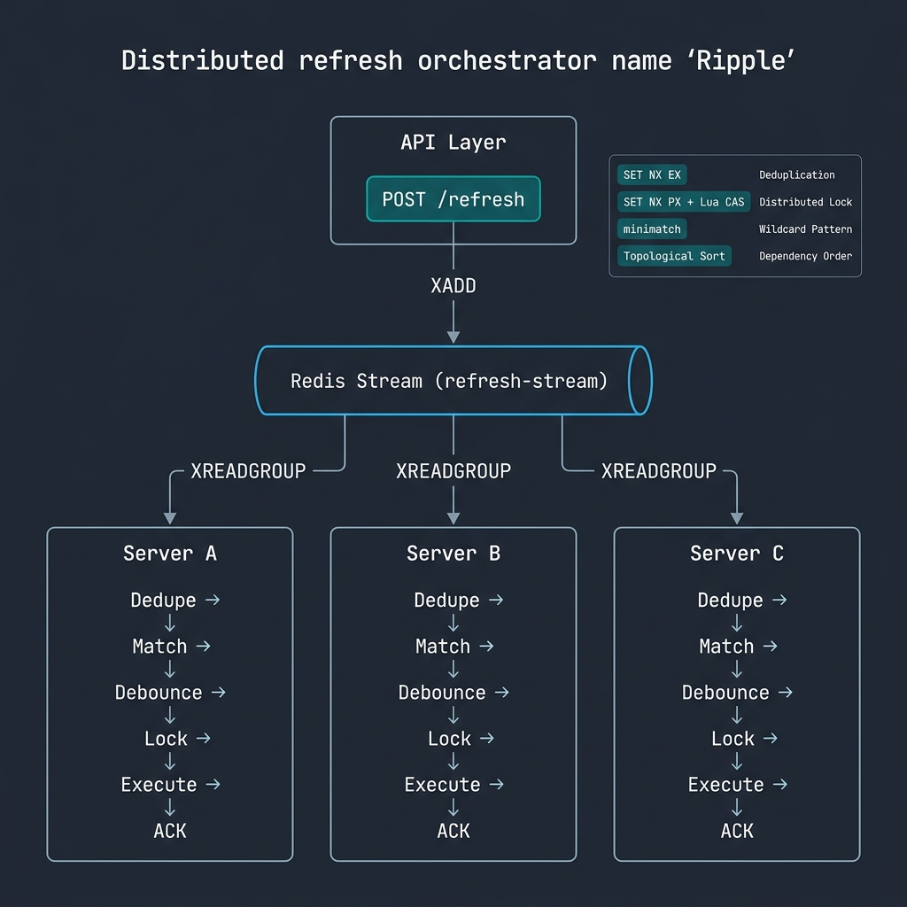
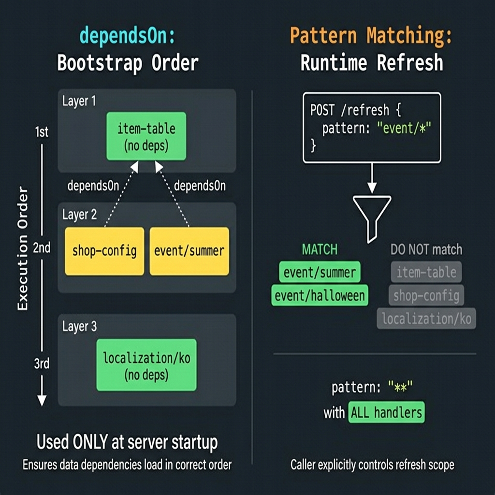

# @gatrix/ripple

분산 리프레시 오케스트레이터 - Redis Streams를 통해 모든 게임 서버 인스턴스에 리프레시 이벤트를 브로드캐스트합니다.

## 아키텍처



모든 서버 인스턴스는 공유 Redis Stream에 자체 Consumer Group을 생성합니다. 리프레시 이벤트가 발행되면 모든 서버가 독립적으로 해당 핸들러를 수신하고 실행합니다 - 수면 위에 파문이 퍼져나가듯이.

## 주요 기능

| 기능 | 메커니즘 | 설명 |
|------|----------|------|
| 브로드캐스트 (Fanout) | 서버별 Consumer Group | 모든 서버가 모든 이벤트 수신 |
| At-Least-Once | XPENDING + XCLAIM | 미확인 메시지 크래시 복구 |
| 중복 실행 방지 | SET NX EX | (requestId, key, server) 조합별 중복 차단 |
| 분산 잠금 | SET NX PX + Lua CAS | 동일 핸들러 동시 실행 방지 |
| 와일드카드 매칭 | minimatch | `event/*`, `**` 등 glob 패턴 |
| 의존성 체인 | Topological Sort | 핸들러 간 실행 순서 보장 |
| 디바운스 | 인메모리 타이머 | 연속 이벤트를 키별로 병합 |
| 재시도 | 지수 백오프 | 최대 재시도 횟수 및 지연 상한 설정 |
| 부트스트랩 | 병렬 실행 | 서버 시작 시 모든 데이터 프리로드 |
| 메트릭 | prom-client | Prometheus 히스토그램, 카운터, 게이지 |

## 빠른 시작

```typescript
import { createRipple } from '@gatrix/ripple';

const ripple = createRipple({
  serverId: `lobbyd-${hostname()}`,
  redis: { host: 'redis.internal', port: 6379 },
});

ripple.register({
  key: 'item-table',
  refresh: async (ctx) => {
    const items = await db.query('SELECT * FROM items');
    itemCache.replace(items);
  },
});

await ripple.start();
app.use('/ripple', ripple.createRouter());
```

## 활용 사례

### 1. 의존성 기반 핸들러 등록

```typescript
import { createRipple, Refreshable } from '@gatrix/ripple';

const ripple = createRipple({
  serverId: 'worldd-1',
  redis: { host: 'localhost', port: 6379 },
});

// 기본 데이터: 의존성 없음
ripple.register({
  key: 'item-table',
  refresh: async (ctx) => {
    console.log(`[item-table] trigger=${ctx.trigger}`);
    const rows = await db.query('SELECT * FROM game_items');
    ItemTable.reload(rows);
  },
  timeoutMs: 15000,
});

// item-table에 의존: item-table 완료 후 실행됨
ripple.register({
  key: 'shop-config',
  refresh: async (ctx) => {
    console.log(`[shop-config] trigger=${ctx.trigger}`);
    const config = await db.query('SELECT * FROM shop_configs');
    ShopManager.reload(config);
  },
  dependsOn: ['item-table'],
  timeoutMs: 10000,
});

// 이벤트 데이터 + 디바운스: CMS에서 빠르게 연속 수정해도 3초 내 1회만 실행
ripple.register({
  key: 'event/summer',
  refresh: async (ctx) => {
    const eventData = await cms.fetchEvent('summer');
    EventManager.update('summer', eventData);
  },
  debounceMs: 3000,
});

const result = await ripple.start();
// 부트스트랩 실행 순서:
//   item-table     (의존성 없음, 먼저 실행)
//   shop-config    (item-table 완료 후)
//   event/summer   (shop-config과 병렬 실행 가능)
```

## dependsOn vs 패턴 매칭



이 두 개념의 명확한 차이를 이해하는 것이 중요합니다:

### dependsOn = 부트스트랩 순서 전용

`dependsOn`은 **서버 시작(부트스트랩) 시 실행 순서만** 제어합니다.
런타임에 자동 캐스케이드 리프레시를 발생시키지 않습니다.

```
서버 시작 (bootstrap):

  Layer 1:  [item-table]  [localization/ko]     -- 의존성 없음, 먼저 실행
  Layer 2:  [shop-config] [event/summer]         -- item-table에 의존, 그 다음 실행
  Layer 3:  [price-calc]                         -- shop-config에 의존, 마지막 실행
```

`shop-config`이 `dependsOn: ['item-table']`을 선언하면:
- **부트스트랩 시**: `item-table`이 `shop-config`보다 먼저 로드됨. 보장됨.
- **런타임 시**: `item-table`을 리프레시해도 `shop-config`이 자동으로 리프레시되지 않음.

이것은 의도된 설계입니다. 암묵적 캐스케이드는:
- 디버깅이 어렵습니다 ("item-table만 갱신했는데 왜 shop-config이 다시 로드됐지?")
- 예측이 어렵습니다 (깊은 의존성 체인이 예상치 못한 부하를 유발)
- 불필요합니다 (와일드카드 패턴이 이미 다중 핸들러 리프레시를 지원)

### 패턴 매칭 = 런타임 리프레시 범위 지정

런타임에는 **호출자가 glob 패턴으로 범위를 명시적으로 결정**합니다:

| 패턴 | 효과 | 용도 |
|------|------|------|
| `"item-table"` | 정확한 매칭, 단일 핸들러 | 아이템 데이터만 갱신 |
| `"event/*"` | event/ 하위 전체 | 모든 이벤트 갱신 |
| `"**"` | 등록된 모든 핸들러 | 전체 데이터 리로드 |
| `"localization/*"` | 모든 로컬라이제이션 | 전체 언어 데이터 갱신 |

```bash
# item-table만 리프레시 (shop-config은 영향 없음)
curl -X POST /ripple/refresh -d '{"pattern": "item-table"}'

# item-table과 shop-config을 함께 리프레시
curl -X POST /ripple/refresh -d '{"pattern": "{item-table,shop-config}"}'

# 배포 후 전체 리프레시
curl -X POST /ripple/refresh -d '{"pattern": "**", "triggeredBy": "deploy"}'
```

이 설계는 **"암묵적보다 명시적이 낫다"** 원칙을 따릅니다.
호출자는 정확히 무엇이 갱신되는지 알 수 있습니다. 숨겨진 캐스케이드가 없습니다.

### 2. 와일드카드 리프레시 (API)

```bash
# 모든 이벤트 핸들러 리프레시
curl -X POST http://localhost:3000/ripple/refresh \
  -H "Content-Type: application/json" \
  -d '{"pattern": "event/*", "triggeredBy": "admin-panel"}'

# 응답:
# {
#   "requestId": "V1StGXR8_Z5jdHi6B-myT",
#   "pattern": "event/*",
#   "matchedKeys": ["event/summer", "event/halloween", "event/christmas"],
#   "matchedCount": 3,
#   "status": "published"
# }

# 전체 리프레시
curl -X POST http://localhost:3000/ripple/refresh \
  -d '{"pattern": "**", "triggeredBy": "deployment"}'

# 특정 키만 리프레시
curl -X POST http://localhost:3000/ripple/refresh \
  -d '{"pattern": "item-table", "triggeredBy": "cms-webhook"}'
```

### 3. 프로그래밍 방식 발행 (서버 간 통신)

```typescript
// CMS 웹훅 핸들러에서:
app.post('/webhook/cms', async (req, res) => {
  const { contentType } = req.body;

  // 리프레시 이벤트 발행 - 모든 서버가 수신
  const event = RefreshPublisher.createEvent(
    `cms/${contentType}`,
    'cms-webhook',
  );
  await ripple.publisher.publish(event);

  res.json({ published: true, requestId: event.requestId });
});
```

### 4. 기존 로거 연동 (winston/mlog)

```typescript
import { createRipple, RippleLogger } from '@gatrix/ripple';
import mlog from '../motiflib/mlog';

// 기존 로거를 RippleLogger 인터페이스에 맞게 래핑
const rippleLogger: RippleLogger = {
  debug: (msg, meta) => mlog.debug(`[ripple] ${msg}`, meta),
  info:  (msg, meta) => mlog.info(`[ripple] ${msg}`, meta),
  warn:  (msg, meta) => mlog.warn(`[ripple] ${msg}`, meta),
  error: (msg, meta) => mlog.error(`[ripple] ${msg}`, meta),
  child: (bindings) => ({
    debug: (msg, meta) => mlog.debug(`[ripple:${bindings.module}] ${msg}`, meta),
    info:  (msg, meta) => mlog.info(`[ripple:${bindings.module}] ${msg}`, meta),
    warn:  (msg, meta) => mlog.warn(`[ripple:${bindings.module}] ${msg}`, meta),
    error: (msg, meta) => mlog.error(`[ripple:${bindings.module}] ${msg}`, meta),
    child: function(b) { return this; },
  }),
};

const ripple = createRipple(config, rippleLogger);
```

### 5. 그레이스풀 셧다운 연동

```typescript
import { registerShutdownHandler } from '../motiflib/processShutdown';

const ripple = createRipple(config);
await ripple.start();

// 기존 셧다운 시스템에 등록
registerShutdownHandler({
  async stop() {
    await ripple.shutdown();
    // Consumer 정지, 대기 중 디바운스 즉시 실행, Redis 연결 해제
  },
});
```

### 6. Prometheus 메트릭 모니터링

```
GET /ripple/metrics

# HELP ripple_refresh_duration_seconds 리프레시 핸들러 실행 시간
# TYPE ripple_refresh_duration_seconds histogram
ripple_refresh_duration_seconds_bucket{key="item-table",trigger="refresh",status="success",le="0.1"} 42
ripple_refresh_duration_seconds_bucket{key="item-table",trigger="refresh",status="success",le="0.5"} 47

# HELP ripple_refresh_success_total 성공한 리프레시 총 횟수
# TYPE ripple_refresh_success_total counter
ripple_refresh_success_total{key="item-table",trigger="refresh"} 47

# HELP ripple_refresh_running_count 현재 실행 중인 핸들러 수
# TYPE ripple_refresh_running_count gauge
ripple_refresh_running_count{key="item-table"} 0
```

### 7. 디버그 모드: 의존성 그래프 시각화

`logLevel`을 `'debug'`로 설정하면 시작 시 의존성 그래프를 출력합니다:

```
Dependency Graph (4 refreshables):
  item-table
    -> shop-config
    -> event/summer
  shop-config [depends on: item-table]
    (no dependents)
  event/summer [depends on: item-table]
    (no dependents)
  localization/ko
    (no dependents)
```

## API 엔드포인트

### POST /refresh

리프레시 이벤트를 발행합니다. 매칭된 핸들러 목록을 응답합니다.

**요청:**
```json
{ "pattern": "event/*", "triggeredBy": "admin-api" }
```

**응답 200:**
```json
{
  "requestId": "abc123",
  "pattern": "event/*",
  "matchedKeys": ["event/summer", "event/halloween"],
  "matchedCount": 2,
  "status": "published"
}
```

**응답 404 (매칭 없음):**
```json
{ "error": "No refreshables match pattern", "pattern": "unknown/*" }
```

### GET /refreshables

등록된 모든 핸들러와 설정을 조회합니다.

### GET /metrics

Prometheus 텍스트 형식 메트릭 엔드포인트.
### GET /health

헬스 체크 엔드포인트.

## 상세 설정

아래 모든 설정은 **[필수]** 표시가 없는 한 선택사항입니다. 기본값은 괄호 안에 표시됩니다.

---

### 핵심 설정

#### `serverId` **[필수]**

```typescript
serverId: 'lobbyd-1'
```

이 서버 인스턴스의 고유 식별자. 모든 서버는 반드시 고유한 ID를 가져야 합니다:
- 서버별 전용 Redis Consumer Group (`group:<serverId>`)이 생성됩니다.
- 중복 방지 키에 serverId가 포함되어 각 서버가 동일 이벤트를 독립적으로 처리합니다.
- 분산 잠금이 서버별로 범위가 지정됩니다.

**권장 형식:** `<프로세스타입>-<호스트명>` (예: `lobbyd-worker-01`, `worldd-us-east-1`)

**주의:** 두 서버가 동일한 `serverId`를 사용하면, 한 서버가 다른 서버의 스트림 메시지를 가로챕니다. 이벤트가 둘 다가 아닌 하나에서만 처리됩니다.

---

#### `redis` **[필수]**

```typescript
redis: {
  host: 'redis.internal',   // Redis 서버 호스트명
  port: 6379,                // Redis 서버 포트
  password: 'secret',        // AUTH 비밀번호 (선택)
  db: 0,                     // SELECT 데이터베이스 인덱스 (기본값: 0)
  keyPrefix: 'myapp:',       // 모든 Redis 키의 접두사 (선택)
}
```

Ripple은 내부적으로 **두 개**의 ioredis 연결을 생성합니다:
1. **Subscriber 연결** - `XREADGROUP` 블로킹 읽기 전용 (다른 커맨드와 공유 불가)
2. **Command 연결** - 잠금, 중복 방지, 발행, ACK 등 비블로킹 작업용

두 연결 모두 동일한 설정을 사용합니다. TLS 등 고급 ioredis 옵션이 필요하면 `redis.options`로 전달하세요.

---

#### `logLevel` (기본값: `'info'`)

```typescript
logLevel: 'info'  // 'debug' | 'info' | 'warn' | 'error' | 'silent'
```

| 레벨 | 출력 내용 |
|------|----------|
| `debug` | 의존성 그래프, 중복 방지 결정, 잠금 획득/해제 등 모든 정보 |
| `info` | 부트스트랩 진행, 컨슈머 시작/중지, 리프레시 결과 |
| `warn` | 복구 실패, 잠금 경합, 타임아웃 경고 |
| `error` | 핸들러 예외, 컨슈머 루프 크래시 |
| `silent` | 출력 없음 (테스트용) |

**`debug` 사용 시점:** 초기 설정 시 의존성 그래프와 핸들러 등록을 확인할 때. 프로덕션에서는 비활성화 - 메시지별 상세 로그로 인해 출력량이 매우 많습니다.

---

#### `defaultTimeoutMs` (기본값: `30000`)

```typescript
defaultTimeoutMs: 30000  // 30초
```

단일 리프레시 핸들러의 최대 실행 시간. 이 시간을 초과하면 핸들러가 중단되고 `timeout` 상태로 기록됩니다. 자체 `timeoutMs`를 지정하지 않은 핸들러에 적용됩니다.

**영향:** 너무 낮게 설정하면 정상적인 느린 쿼리가 강제 종료됩니다. 너무 높게 설정하면 멈춘 핸들러가 분산 잠금 뒤에서 다른 리프레시를 차단합니다.

**핸들러별 재정의:**
```typescript
ripple.register({
  key: 'heavy-analytics',
  timeoutMs: 120000,  // 이 핸들러만 2분
  refresh: async (ctx) => { /* 느린 집계 쿼리 */ },
});
```

---

### 스트림 설정

Redis Stream의 이벤트 전달 동작을 제어합니다.

```typescript
stream: {
  key: 'refresh-stream',
  blockMs: 5000,
  batchSize: 10,
  maxLen: 10000,
}
```

#### `stream.key` (기본값: `'refresh-stream'`)

공유 스트림의 Redis 키 이름. 같은 클러스터의 모든 서버는 반드시 동일한 키를 사용해야 동일한 이벤트를 수신합니다.

**변경 시점:** 같은 Redis 인스턴스에서 여러 독립 ripple 클러스터를 운영할 때 (예: staging vs production). `'refresh-stream:staging'`과 `'refresh-stream:prod'`처럼 구분하세요.

#### `stream.blockMs` (기본값: `5000`)

`XREADGROUP BLOCK`의 타임아웃(밀리초). 컨슈머가 새 메시지를 이 시간만큼 대기한 후 루프합니다.

| 값 | 트레이드오프 |
|----|------------|
| `1000` | 더 빠른 응답 (최대 1초 지연), Redis CPU 부하 증가 |
| `5000` | 대부분의 워크로드에 적합 |
| `30000` | Redis CPU 절약, 하지만 새 이벤트 감지까지 최대 30초 지연 |

**셧다운 영향:** 그레이스풀 셧다운은 현재 BLOCK이 반환될 때까지 대기합니다. `blockMs`가 30000이면 셧다운에 최대 30초 소요될 수 있습니다.

#### `stream.batchSize` (기본값: `10`)

`XREADGROUP` 호출당 읽는 메시지 수 (`COUNT` 파라미터).

**증가 시점:** 시스템이 버스트로 많은 이벤트를 발행할 때 (예: CMS 대량 업데이트). 50-100으로 증가하면 배치 처리 효율이 올라갑니다.

**감소 시점:** 각 핸들러가 비용이 높을 때 (>5초). 1-3으로 설정하여 무거운 작업이 과도하게 큐잉되는 것을 방지합니다.

#### `stream.maxLen` (기본값: `10000`)

스트림의 대략적 최대 엔트리 수. Redis는 성능을 위해 `MAXLEN ~` (근사 트리밍)을 사용합니다.

**영향:** 이 한도를 넘는 오래된 엔트리는 삭제됩니다. 서버가 오래 오프라인이었고 스트림이 마지막 읽기 위치를 넘어 트리밍되었다면, 해당 서버는 그 이벤트를 놓칩니다. 현재 위치부터 재개됩니다.

**증가 시점:** 서버가 장시간 오프라인 가능하고 더 많은 히스토리를 유지하고 싶을 때.

**감소 시점:** 고처리량 환경에서 Redis 메모리 사용량을 줄이고 싶을 때.

---

### 재시도 설정

핸들러 실패 시 자동 재시도 동작을 제어합니다.

```typescript
retry: {
  maxRetries: 3,
  retryDelayMs: 1000,
  exponentialBackoff: true,
  maxDelayMs: 30000,
}
```

**중요:** 재시도는 **런타임 리프레시** (trigger=`'refresh'`)에만 적용됩니다. 부트스트랩 실패는 재시도되지 않으며 부트스트랩 결과에 보고됩니다.

#### `retry.maxRetries` (기본값: `3`)

초기 실패 후 최대 재시도 횟수. 총 실행 횟수 = 1 (초기) + maxRetries.

| 값 | 총 시도 | 용도 |
|----|--------|------|
| `0` | 1 | 재시도 없음, 즉시 실패 (비핵심 데이터) |
| `3` | 4 | 기본값, 일시적 DB/네트워크 오류에 적합 |
| `10` | 11 | 불안정한 외부 API에 의존하는 핸들러 |

#### `retry.retryDelayMs` (기본값: `1000`)

재시도 간 기본 지연(밀리초). 지수 백오프 활성화 시 실제 지연:

```
시도 1: 1000ms
시도 2: 2000ms
시도 3: 4000ms  (maxDelayMs로 제한)
```

#### `retry.exponentialBackoff` (기본값: `true`)

`true`이면 각 재시도마다 `retryDelayMs * 2^(시도-1)`만큼 대기. `false`이면 모든 재시도가 동일한 `retryDelayMs` 사용.

**비활성화 시점:** 예측 가능한 고정 간격 재시도가 필요할 때 (예: 알려진 복구 시간이 있는 서비스 폴링).

#### `retry.maxDelayMs` (기본값: `30000`)

지수 백오프 지연의 상한. 지연이 무한정 증가하는 것을 방지합니다.

**기본값 예시:** 지연은 1초, 2초, 4초, 8초, 16초, 30초, 30초, 30초... (30초에서 상한)

---

### 컨슈머 설정

미확인 메시지의 크래시 복구 메커니즘을 제어합니다.

```typescript
consumer: {
  pendingReclaimIntervalMs: 30000,
  claimMinIdleMs: 60000,
  claimBatchSize: 100,
}
```

**동작 원리:** 서버가 실행 중 크래시하면, 미확인(ACK되지 않은) 메시지가 Redis에 "pending" 상태로 남습니다. 다른 서버(또는 재시작된 같은 서버)가 주기적으로 이 고아 메시지를 스캔하여 재처리합니다.

#### `consumer.pendingReclaimIntervalMs` (기본값: `30000`)

`XPENDING`을 사용하여 고아 pending 메시지를 확인하는 주기(밀리초).

| 값 | 트레이드오프 |
|----|------------|
| `5000` | 빠른 크래시 복구, Redis 쿼리 빈도 증가 |
| `30000` | 적절한 균형 |
| `120000` | Redis 부하 최소화, 하지만 고아 메시지가 최대 2분 대기 |

#### `consumer.claimMinIdleMs` (기본값: `60000`)

`XCLAIM`으로 재요청하기 전 pending 메시지가 유휴 상태여야 하는 최소 시간(밀리초).

**주의:** 이 값이 너무 낮으면, 느린 핸들러가 정상적으로 처리 중인 메시지가 다른 서버에 의해 재요청되어 중복 실행이 발생할 수 있습니다. 이 값은 **가장 긴 핸들러 타임아웃 + 재시도 지연보다 커야** 합니다.

**안전 공식:** `claimMinIdleMs > defaultTimeoutMs + (maxRetries * maxDelayMs)`

기본값 기준: `60000 > 30000 + (3 * 30000)` -- 기본값으로는 안전하지 않습니다. 느린 핸들러와 재시도가 있다면 `120000`으로 증가를 고려하세요.

#### `consumer.claimBatchSize` (기본값: `100`)

주기당 재요청하는 최대 pending 메시지 수.

**증가 시점:** 장시간 서버 장애 후 누적된 pending 메시지가 많을 때, 높은 배치 크기가 복구 속도를 높입니다.

---

### 중복 방지 설정

```typescript
dedupe: {
  ttlSec: 3600,
}
```

#### `dedupe.ttlSec` (기본값: `3600`)

중복 방지 키가 Redis에 유지되는 시간(초). 이 기간 동안 동일한 (requestId + refreshKey + serverId) 조합은 자동으로 건너뜁니다.

**너무 낮을 때의 영향:** 메시지가 TTL 만료 후 재시도되거나 재요청되면 중복 실행될 수 있습니다.

**너무 높을 때의 영향:** 중복 방지 키로 인한 Redis 메모리 사용량 증가.

**권장:** 기본값(1시간) 유지. 메시지가 pending + 재시도될 수 있는 최대 시간을 초과해야 합니다.

---

### 부트스트랩 설정

서버 시작 시 데이터 로딩 동작을 제어합니다.

```typescript
bootstrap: {
  parallel: true,
  timeoutMs: 30000,
  failFast: true,
  concurrency: 10,
}
```

#### `bootstrap.parallel` (기본값: `true`)

`true`이면 독립적인 핸들러(의존성 체인에 없는 핸들러)가 병렬 실행됩니다.

```
parallel=true:   [item-table] + [localization/ko]  (동시 실행)
                 이후 [shop-config]                 (item-table 이후)

parallel=false:  [item-table] -> [localization/ko] -> [shop-config]  (순차 실행)
```

**비활성화 시점:** 시작 시 데이터베이스가 동시 연결을 처리할 수 없거나, 핸들러가 공유 자원을 경쟁할 때.

#### `bootstrap.timeoutMs` (기본값: `30000`)

전체 부트스트랩 단계의 시간 예산. 초과 시 나머지 핸들러는 건너뜁니다.

**주의:** 이것은 핸들러별이 아닌 전체 타임아웃입니다. 각 2초씩 걸리는 핸들러 20개가 있다면, 순차 실행 시 최소 40초가 필요합니다.

#### `bootstrap.failFast` (기본값: `true`)

`true`이면 첫 핸들러 실패 시 즉시 부트스트랩이 중단됩니다. `false`이면 계속 진행하고 모든 실패를 마지막에 보고합니다.

| 값 | 용도 |
|----|------|
| `true` | 프로덕션 - 핵심 데이터 로드 필수. 기본 데이터 실패 시 의존 데이터 로드 무의미. |
| `false` | 개발/테스트 - 모든 실패를 한번에 확인하여 일괄 수정. |

#### `bootstrap.concurrency` (기본값: `10`)

단일 의존성 레이어 내에서 동시 실행되는 최대 핸들러 수.

**감소 시점:** 부트스트랩이 너무 많은 동시 쿼리로 데이터베이스에 과부하를 줄 때. 커넥션 풀이 제한된 데이터베이스는 3-5로 설정.

---

### 핸들러별 옵션

전역 설정이 아닌 개별 `Refreshable` 등록에 설정합니다.

```typescript
ripple.register({
  key: 'event/summer',
  refresh: handler,

  // 핸들러별 옵션:
  timeoutMs: 10000,              // 전역 defaultTimeoutMs 재정의
  dependsOn: ['item-table'],     // 부트스트랩 순서 (런타임 캐스케이드 아님)
  debounceMs: 3000,              // 이 시간 내 연속 이벤트 병합
});
```

#### `timeoutMs` (핸들러별)

이 핸들러에 대해 전역 `defaultTimeoutMs`를 재정의합니다.

#### `dependsOn` (핸들러별)

부트스트랩 중 이 핸들러보다 먼저 완료되어야 하는 핸들러 키 배열. [dependsOn vs 패턴 매칭](#dependson-vs-패턴-매칭) 섹션을 참조하세요.

#### `debounceMs` (핸들러별)

설정 시, 디바운스 기간 내 이 핸들러에 대한 여러 리프레시 이벤트가 단일 실행으로 병합됩니다. 기간 내 **마지막** 이벤트만 실제 리프레시를 트리거합니다.

**사용 시점:** CMS 편집으로 트리거되는 핸들러에서 편집자가 빠르게 여러 번 저장할 때. 2-3초 디바운스가 불필요한 리로드를 방지합니다.

**주의:** 디바운스된 실행은 fire-and-forget입니다. 스트림 메시지는 즉시 ACK되고, 실제 핸들러는 디바운스 기간 만료 후 실행됩니다. 디바운스 기간 중 서버가 크래시하면 대기 중인 실행이 유실됩니다.

---

## 게임 서버 배포

```bash
cd packages/ripple
yarn deploy:game         # build -> pack -> game/server/node/lib/ 복사
yarn deploy:game --bump  # 패치 버전 증가 + 배포
```

배포 후 게임 서버에서:
```bash
cd game/server/node
yarn install
yarn build
```

게임 서버 코드에서 import:
```typescript
import { createRipple } from '@gatrix/ripple';
```

## 라이선스

MIT
